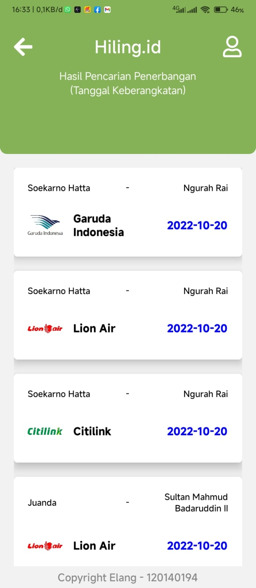

# Tugas 3 PAM 2022

## Airplane Ticket

### Description

This is a simple airplane ticket app. It is made using React Native. Data is dummy data, you can get it [here](./data/jadwal.json).

### Dependencies

- React Native
- React Navigation
- React Native Stack
- React Native Vector Icons
- React Elements Dropdown

### How to run this app

1. Clone this repository

```bash
git clone https://github.com/maybeenang/Tugas-3-PAM-2022.git
```

2. Install all dependencies

```bash
npm install
```

3. Run the app

```bash
npm start
```

4. Open the app

```bash
Open the app using Expo Go on your phone. Scan the QR code on the terminal or in the browser.
```

### How to build this app

1. Install Expo CLI

```bash
npm install -g expo-cli
```

2. Build the app

```bash
expo build:android
```

3. Download the app

```bash
Download the app from the link that is given on the terminal.
```

## Screenshot




## Author

Muhammad Elang Permadani - 120140194
